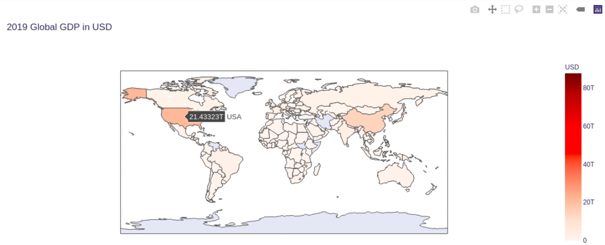

# Global GDP - 2019

A statistical analysis on 2019 Global GDP using Choropleth maps.


## Demo

[https://asis2016.github.io/global-gdp-2019-analysis/](https://asis2016.github.io/global-gdp-2019-analysis/)

  
## Tech Stack

Python, Jupyter Notebook, HTML

  
## Run Locally

Clone the project

```bash
  git clone https://github.com/asis2016/global-gdp-2019-analysis.git
```

Go to the project directory

```bash
  cd global-gdp-2019-analysis
```


Upload the following file to your Jupyter notebook

```bash
  global-gdp-2019-analysis.ipynb
```

## Screenshots



## Feedback

If you have any feedback, please reach out to us at hello@amaharjan.com
  
## Reference

 - [The World Bank](https://data.worldbank.org/)

  